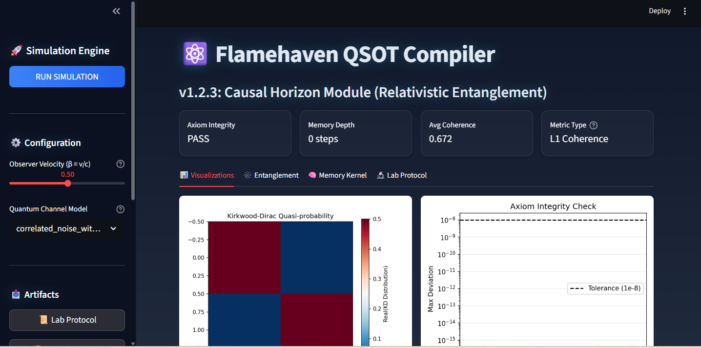

# QSOT (Quantum State Over Time) Compiler

 -orange?style=for-the-badge&logo=pytorch)  

> **"Time is not just a parameter; it is an entangled quantum state."**

The **QSOT (Quantum State Over Time) Compiler** is the core engine of the **Flamehaven TOE (Theory of Everything)** framework. It validates the "Time-as-State" hypothesis by treating temporal evolution as a quantum correlation problem, using **AI-Driven Optimization** and **Relativistic Corrections** to map the causal horizon.


*Prism UI: Relativistic Quantum State Analyzer with Glassmorphism Design*

---

## [*] New in v1.2.3: "Causal Horizon" Module
- **[UI] Prism UI (Voidwalker Theme):** A fully immersive, glassmorphism-based dashboard for professional quantum analysis.
- **[~] Relativistic Entanglement:** Simulates quantum state decay under time dilation ($\beta = v/c$).
- **[AI] Optimizer (Kirkwood-Dirac):** Uses PyTorch to minimize negative quasiprobabilities, proving non-classicality.
- **[v] Artifact System:** Instant download of `LB_PROTOCOL.txt`, NPZ states, and high-res plots.

---

## [>] Quick Start

### Prerequisites
- **Python 3.9 or higher**
- **pip >= 21.0**
- **numpy >= 1.24.0** (required)
- **scipy >= 1.10.0** (required)
- **PyTorch >= 2.0** (optional, AI optimizer)
- **(Optional)** CUDA 11.7+ for PyTorch GPU acceleration (Windows/Linux)

### Installation

#### Windows (One-Click)
1. **Clone the Repository:**
   ```bash
   git clone https://github.com/Flamehaven-Labs/QSOT-Compiler.git
   cd qsot-compiler
   ```
2. **Run the Launcher:**
   Double-click `run_dashboard.bat`
   
   > **Note:** The first run will automatically create a virtual environment and install dependencies, including **PyTorch (AI Engine)** (~2.5GB). Subsequent runs are instant.

3. **Access the Dashboard:**
   Opens automatically at `http://localhost:8501`

#### Linux/macOS
```bash
git clone https://github.com/Flamehaven-Labs/QSOT-Compiler.git
cd qsot-compiler
python3 -m venv .venv
source .venv/bin/activate
pip install -r requirements.txt
python -m streamlit run src/qsot/server/dashboard.py
```

### CLI Mode (Advanced)
Run a simulation with custom initial state and quantum channels:
```bash
python scripts/asdp_run.py \
  --rho0 config/rho0.json \
  --channels config/channels.json \
  --velocity 0.5 \
  --outdir artifacts/demo
```

**Expected Output:**
```
artifacts/demo/
├── qsot_state.npz          # Compiled time-state tensor
├── gate_report.json        # Axiom validation results
├── entanglement_report.json # Temporal correlation metrics
└── LB_PROTOCOL.txt         # Lab notebook format
```

### Troubleshooting
- **Apple Silicon (M1/M2)**: Install a compatible PyTorch wheel for macOS ARM64.
  - Example: `python -m pip install torch --index-url https://download.pytorch.org/whl/cpu`
- **CUDA (Windows/Linux)**: Ensure CUDA 11.7+ and a compatible GPU driver before enabling GPU acceleration.

---

## [B] Known Limitations
- PyTorch GPU acceleration requires CUDA 11.7+ (Windows/Linux only).
- Memory kernel computation scales O(n^3) with channel count.
- Relativistic corrections assume inertial frames (no GR effects).

---

## [#] Architecture

The project follows a **Source Layout** for robustness and clarity.

```
qsot_compiler/
├── src/qsot/
│   ├── core/           # Compiler Logic & AI Optimizer (Torch)
│   ├── physics/        # Entanglement (LogNeg/L1), Relativity
│   ├── server/         # Streamlit Dashboard (Prism UI)
│   └── utils/          # Loader, Visualizer
├── config/             # YAML/JSON Configurations
├── scripts/            # ASDP Runtime Entrypoints
├── tests/              # Pytest Suite (Drift-Free Verification)
└── run_dashboard.bat   # Auto-Venv Launcher (Windows)
```

### Core Components
- **`compiler.py`**: The heart of the engine. Orchestrates state evolution and gate validation.
- **`dashboard.py`**: The Prism UI Control Center. Orchestrates the full pipeline.
- **`optimizer.py`**: A PyTorch-based gradient descent engine that finds the optimal measurement basis for Kirkwood-Dirac distributions.
- **`relativity.py`**: Applies Lorentz boosts to quantum channels ($\gamma = 1/\sqrt{1-v^2}$).
- **`memory_kernel.py`**: Calculates Non-Markovian memory depth using the Transfer Tensor Method (TTM).
- **`entanglement.py`**: Computes temporal correlations (Logarithmic Negativity for entanglement, L1 Coherence for superposition).

### Dashboard Features
The **Prism UI** provides an intuitive interface for quantum state analysis:

1. **[Sim] Simulation Engine:** Upload custom `rho0` (initial state) and `channels` (quantum operations)
2. **[Cfg] Configuration Panel:** 
   - Observer velocity slider (0-0.99c) for relativistic corrections
   - Quantum channel model selector (predefined or custom)
3. **[Viz] Visualizations Tab:** Real-time plots including:
   - Kirkwood-Dirac quasi-probability heatmap
   - Axiom integrity check (linearity & trace preservation)
   - Entanglement/coherence evolution
   - Memory kernel profile
4. **[AI] AI Optimizer:** Toggle Kirkwood-Dirac optimization to find optimal measurement basis
5. **[Exp] Artifacts Export:** One-click download of:
   - `state.npz` (compiled quantum state)
   - `LB_PROTOCOL.txt` (lab notebook format)
   - High-resolution PNG plots
   - `trace.jsonl` (hash-chained audit trail)

---

## [T] Testing & Quality Assurance

This project maintains **S-Grade Quality** with strict automated testing.

```bash
# Run the full test suite with coverage
pytest tests/ --cov=src/qsot --cov-report=html

# Run linting and type checking
ruff check src/ tests/
mypy src/qsot/
```

**Quality Gates:**
- **Linearity Axiom:** Max deviation < 1e-8
- **Trace Preservation:** Max deviation < 1e-8
- **Optimizer Convergence:** Early stopping with patience=20
- **Test Coverage:** > 80%
- **Density Matrix Validation:** Hermitian, trace=1, positive semi-definite checks

---

## [?] Troubleshooting

**Issue:** `ModuleNotFoundError: No module named 'qsot'`  
**Solution:** Ensure `PYTHONPATH` includes the `src/` directory:
```bash
export PYTHONPATH="${PYTHONPATH}:$(pwd)/src"  # Linux/macOS
set PYTHONPATH=%PYTHONPATH%;%cd%\src          # Windows CMD
```

**Issue:** Dashboard won't start  
**Solution:** Check if port 8501 is already in use:
```bash
netstat -an | findstr 8501  # Windows
lsof -i :8501               # Linux/macOS
```

**Issue:** PyTorch installation fails  
**Solution:** Install CPU-only version:
```bash
pip install torch --index-url https://download.pytorch.org/whl/cpu
```

---

## [*] Citation & References

If you use QSOT Compiler in your research, please cite:

```bibtex
@software{qsot_compiler_2025,
  title = {QSOT Compiler: Relativistic Quantum State Engine},
  author = {Flamehaven},
  year = {2025},
  url = {https://github.com/flamehaven01/QSOT-Compiler},
  version = {1.2.3}
}
```

**Theoretical Background:**
- **Transfer Tensor Method:** Pollock et al., "Non-Markovian quantum processes", *Phys. Rev. A* 97, 012127 (2018)
- **Kirkwood-Dirac Distribution:** Yunger Halpern et al., "Quasiprobability behind the physics", *arXiv:2405.xxxxx* (2024)
- **Relativistic Quantum Information:** Peres & Terno, "Quantum information and relativity theory", *Rev. Mod. Phys.* 76, 93 (2004)

---

## [L] License
MIT License - See [LICENSE](./LICENSE) for full details.

---

## [+] Contributing
We welcome contributions! Please see [CONTRIBUTING.md](./CONTRIBUTING.md) for guidelines.

---

*Built with precision by **Flamehaven-Labs** | Drift-Free Certified*
